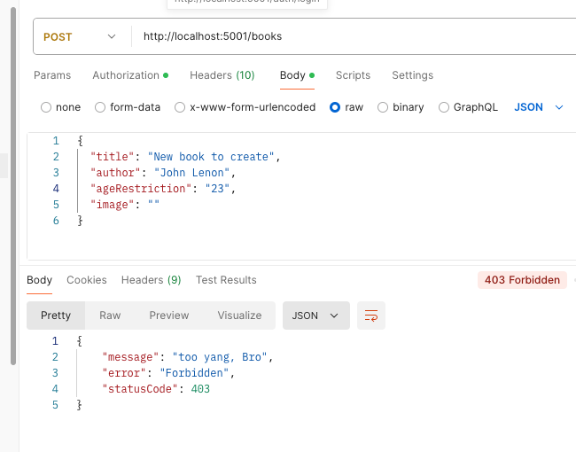
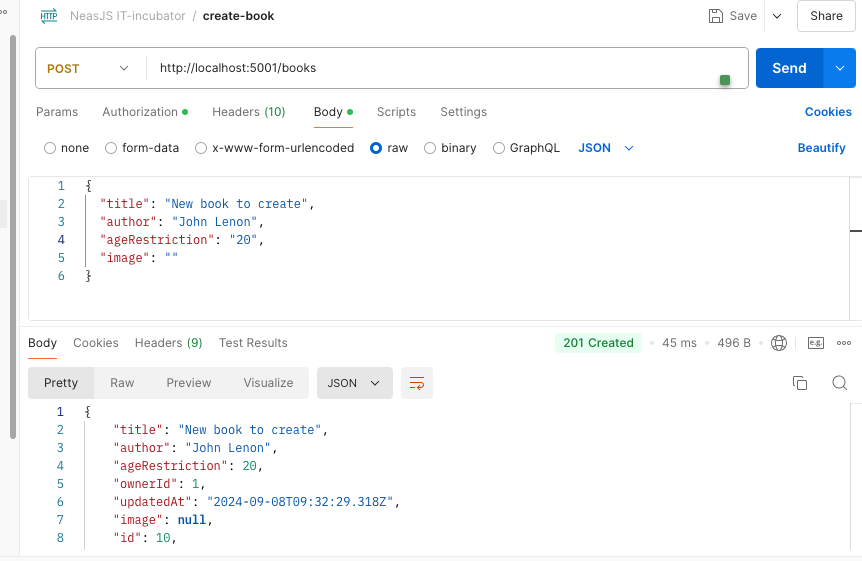

# Create 12-business-logic branch
# Бизнес логика приложения

## 1 Техническое задание 1

**Только совершеннолетние пользователи могут добавлять книги в книжную лавку, у которых возрастное ограничение больше 18**

Реализуем эту логику в методе `BooksService.createBook(dto: CreateBookDto)`:
1. Добавим недостающий аргумент в метод
2. Запросим пользователя, который делает запрос на создание книги, чтобы проверить его возраст 
### books.service.ts
```typescript
    constructor(
        private readonly booksRepository: BooksRepository,
        private readonly usersRepository: UsersRepository,
    ) {}

  async createBook(dto: CreateBookDto, userId: string): Promise<Book> {
    const id = parseInt(userId);
    const user = await this.usersRepository.findByIdOrNotFoundFail(id);
    if (!user) throw new UnauthorizedException();
    if (user.age < parseInt(dto.ageRestriction))
     throw new ForbiddenException('too yang, Bro');
    const book = new Book();
    book.title = dto.title;
    book.author = dto.author;
    book.ageRestriction = Number(dto.ageRestriction);
    book.ownerId = Number(userId);

    return await this.booksRepository.save(book);
  }
```
3. Инжектируем нужные зависимости
### books.module.ts
```typescript
@Module({
    imports: [TypeOrmModule.forFeature([Book, User])], // !!!!!!!!!!!!!!!!! User
    controllers: [BooksController],
    providers: [BooksService, BooksRepository, JwtStrategy, UsersRepository], // !!!!!! UsersRepository
})
export class BooksModule {}
```

4. Проверяем возраст и возрастные ограничения у книги - если ОК - создаем книгу, если нет - `ForbiddenException('too yang, Bro')`
See above in books.service.ts

```typescript
if (user.age < parseInt(dto.ageRestriction)) throw new ForbiddenException('too yang, Bro');
```
5. Изменим настройку `{ nullable: true }` колонки `ownerId` сущности `Book`, 
теперь анонимный пользователь не может добавлять книги и мы будем хранить его Id в "книге" `ownerId`
```typescript
  @Column({ nullable: false })
  ownerId: number; //id пользователя, который добавил книгу
```
6. Делаем необходимые правки в контроллере
```typescript
  @UseGuards(JwtAuthGuard)
  @Post()
  async createBook(@Body() bookDto: CreateBookDto, @Request() req: ReqUserPayLoadJWTInterface) {
    return await this.bookService.createBook(bookDto, req.user.userId);
  }
```
7. Проверяем на фронте





#### 1.1 Инкапсуляция бизнес-логики в методах сущности
Обратим внимание, что в текущей реализации метод сервиса одновременно работает с другими слоями (например, репозиториями) и содержит бизнес-логику приложения. 
Это приводит к тому, что для тестирования бизнес-логики нам приходится интегрировать в тесты базу данных, 
что влечет за собой дополнительные настройки и связывает тесты с БД. 
Однако тестировать работу ORM в тестах, предназначенных для проверки бизнес-логики, нецелесообразно.  

Чтобы улучшить структуру кода, декомпозируем его: вынесем логику создания книги в метод модели `Book`. 
Это доменная сущность, и она должна управлять процессом своего создания. 
Для этого оптимально использовать **статический метод**, поскольку он принадлежит классу. 
Метод экземпляра здесь не подойдет, так как экземпляр еще не существует, а нам нужно инкапсулировать логику создания именно на уровне класса.

1. Создим static метод `createBook()` класса `Book`, который в случае положительного исхода проверки бизнес-требований создаст и вернет новый экземпляр класса `Book`
2. В этот метод перенесем бизнес-логику, связанную с добавлением новой книги и созданием объекта класса `Book`
3. В сервисе будем вызывать метод `Book.createBook()`, передавая в него необходимые аргументы, а затем поручим репозиторию сохранить новую книгу
4. Таким образом, детали логики создания книги будут инкапсулированы в статическом методе-фабрике, который легко можно покрыть unit-тестами

## 2 Техническое задание 2

**Только тот кто добавил книгу (owner) может ее изменить. Учесть, обновление книги должно работает как patch-запрос.**

*Примечание: PATCH — это один из HTTP методов, используемый для частичного обновления ресурса на сервере. 
В отличие от PUT, который обычно используется для полного обновления ресурса,
PATCH позволяет обновить только те поля или свойства ресурса, которые изменились.*

1. Создадим метод **экземпляра** класса `Book` *(??почему не статический ??)* `updateBook()` и передим нужные аргументы
2. Реализуем в нем нужные проверки (бизнес-требования). Не забываем про возможность частичного обновления книги.
3. Создадим `booksService.updateBook()`:
 - Запрашиваем искомую книгу по id. Репозиторий возвращает нам экземпляр класса `Book`.  
*Задача репозитория: пойти в БД, достать данные, создать экземпляр сущности с данными из БД - в нашем случае мы делегировали эту работу ОРМ*
 - Вызываем метод `book.updateBook()`
 - Просим  books repository сохранить обновленную книгу
4. В контроллере вешаем гард для проверки авторизации (по аналогии с созданием книги)
5. Проверяем на фронте

*Примечание:  
Инкапсуляция бизнес-логики в методы сущностей не всегда возможна в полной мере. 
Часто часть логики остается в сервисах (или специальных доменных сервисах). 
Однако, если такая возможность существует, рекомендуется выносить эту логику в отдельные методы сущностей.*

## 3 unit тесты для проверки логики предметной обрасти при создании и обновлении книги (Опционально)
