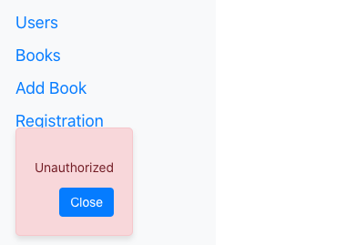

# Create 13-homework branch
# Домашнее задание

1. Дописать удаление книги. Только владелец (ток кто добавил книгу в лавку) может ее удалить

### book.controller.ts
```typescript
  @UseGuards(JwtAuthGuard)
  @Delete(':id')
  async deleteBook(
    @Param('id') id: string,
    @Request() req: ReqUserPayLoadJWTInterface,
) {
    await this.bookService.deleteBook(parseInt(id), parseInt(req.user.userId));
    return { response: `OK. The book with ID: ${id} successfully is deleted`};
}
```
### book.service.ts

```typescript
  async deleteBook(id: number, userId: number) {
    if (!userId)
        throw new BadRequestException(
            'You are not register, it is forbidden for you',
        );
    const book = await this.booksRepository.findOneOrNotFoundFail(id);
    if (!book) throw new BadRequestException('There is not such book');
    const user = await this.usersRepository.findByIdOrNotFoundFail(userId);
    if (!user)
        throw new BadRequestException('Something wrong with you registration');
    if (userId !== book.ownerId)
        throw new ForbiddenException('It is not your book');

    return await this.booksRepository.remove(id);
}
```

2. Переходить на страничку книги (getBookById) могут только авторизованные пользователи. 

### Add @UseGuards(JwtAuthGuard) for getBookById() into book.controller.ts

```typescript 
@UseGuards(JwtAuthGuard)
@Get(':id')
async getBookById(
    @Param('id') id: string,
    @Request() req: ReqUserPayLoadJWTInterface,
    ): Promise<Book> {
    return await this.bookService.getBookById(
        parseInt(id),
        parseInt(req.user.userId),
    );
}
```


3. Не совершеннолетние пользователи не могут переходить на страничку книги, у которой возрастное ограничение "18+"

### Add check out of age in book.service and getting user (and his id) from JWT token in book.controller

```typescript
// book.service.ts
async getBookById(id: number, userId: number): Promise<Book> {
    const idN = Number(id);
    const user = await this.usersRepository.findByIdOrNotFoundFail(userId);
    const book = await this.booksRepository.findOneOrNotFoundFail(idN);
    if (!user) throw new ForbiddenException('You are nor registered');
    if (!book) throw new BadRequestException('Somethind bad with book');
    if (user.age < 18 || user.age < book.ageRestriction)
    throw new ForbiddenException('Sorry bro, you are too yang now...');

    return book;
}
```
```typescript

```


4. "*" Требование №2 отменяется, требование №3 остается. То есть запрашивать книгу (getBookById) могут даже не авторизованные пользователи, 
однако, если книга имеет возрастное ограничение "18+", пользователи младше 18 лет или не авторизованные пользователи не должны получить такую книгу  
---
*Подсказка: нужно будет написать новую стратегию (OptionalJwtStrategy), [которая модифицирует 'jwt' стратегию](https://docs.nestjs.com/recipes/passport#extending-guards)':  
в случае, если пользователь не авторизован - все равно пропускает, однако, при этом, не "прокидывает"
userId через request дальше в контроллер*


# Refactor User Registration

### user.controller
```typescript
@Post('registration')
async registerUser(@Body() dto: RegisterUserDto) {
    return await this.userService.registerUser(dto);
}
```

### user.service

```typescript
async registerUser(dto: RegisterUserDto): Promise<number> {
    let user = await this.usersRepository.findByEmail(dto.email);
    if (user) throw new BadRequestException('This email is registered already');
    user = await User.createUser(dto);

    return user.id;
}
```

### user.entity

```typescript
public static async createUser(dto: RegisterUserDto) {
    const user = new User();
    user.name = dto.name;
    user.age = parseInt(dto.age);
    user.email = dto.email;
    user.passwordHash = await bcrypt.hash(dto.password, 10);
    await user.save();
    return user;
}
```
